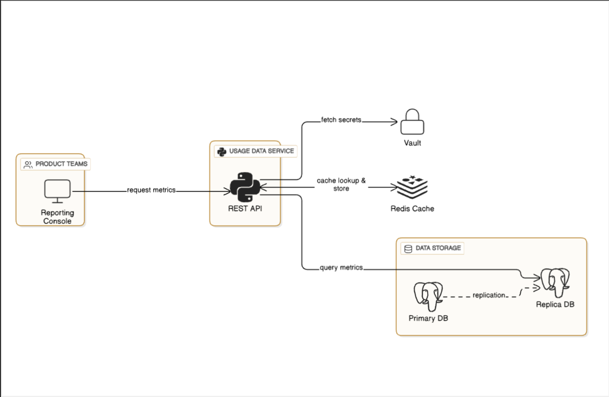

# Curated Usage Data API

A FastAPI-based internal service that provides an endpoint to query **daily active user (DAU)** metrics from PostgreSQL. Includes secrets management via **HashiCorp Vault**, performance caching via **Redis**, and local deployment with **Docker Compose**.

## Features

- `GET /v1/daily-active-users`: returns DAU between two dates
- Redis caching for performance
- Swagger UI at `/docs`
- PostgreSQL for storage
- Vault for secrets management
- Dockerized setup for local dev

## Architecture

- **FastAPI**: main API app
- **PostgreSQL**: stores daily activity
- **Redis**: caches query results
- **Vault**: stores API key and DB credentials securely
- **Docker Compose**: orchestrates the stack

## Setup Instructions

1. **Start all services:**

```bash
docker-compose up -d
````

2.  **Visit Swagger UI:** [http://localhost:8000/docs](http://localhost:8000/docs)

## API Authentication
All requests must include:

```
x-api-key: supersecretkey
```

The key is stored in Vault under `secret/dau-creds`.

## Example Request

```bash
curl -H "x-api-key: supersecretkey" \
  "http://localhost:8000/daily-active-users?start_date=2024-07-20&end_date=2024-07-22"
```

## Running Tests

```bash
docker-compose exec api pytest tests/test_main.py
```

## Configuration via Vault

Secrets are stored at:

```
secret/dau-creds
```

And include:
-  api_key
- pg_primary_host
- pg_primary_port
- pg_primary_user
- pg_primary_pw
- pg_primary_name
- pg_replica_host
- pg_replica_port
- pg_replica_user
- pg_replica_pw
- pg_replica_name

## Health Check

Use `/healthcheck` to verify API is running.


